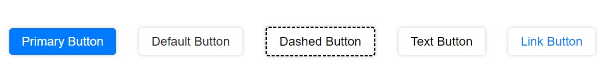

# Publishing Assignment / Buttons

This is a simple and customizable button component that can be easily integrated into your React projects. It provides various button types such as primary, default, dashed, text, and link, allowing you to style your buttons according to your design needs.

# Usage

```javascript
import { Button } from 'button-component-fakirherif';

function App() {
  return (
    <>
        <Button type="primary" text="Primary Button"/>
        <Button type="default" text="Default Button"/>
        <Button type="dashed" text="Dashed Button"/>
        <Button type="text" text="Text Button"/>
        <Button type="link" text="Link Button"/>
    </>
  );
}

export default App;
```

# Props

Determines the style of the button. Possible values: 'primary', 'default', 'dashed', 'text', 'link'.

# SS

