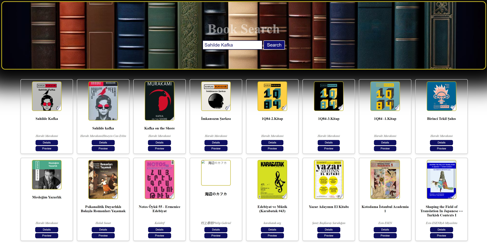

# Book Search

Book Search is a React application that allows users to search for books using the Google Books API. Users can enter a query in the search bar to retrieve a list of books matching their search criteria. The application displays book results with their titles, authors, covers, and provides options to view book details and previews.

## Features

- **Search Bar:** Enter keywords in the search bar to find books.
- **Book Cards:** Display search results with book covers, titles, and authors.
- **Details Button:** Click on the "Details" button to view additional information about a book.
- **Preview Button:** Click on the "Preview" button to open the book's Google Books page in a new tab.
- **Modal:** Show detailed information about a selected book in a modal.

## Technologies Used

- **React:** Front-end library for building user interfaces.
- **axios:** HTTP client for making API requests.
- **Google Books API:** Provides access to book information and metadata.

## Installation

1. Clone this repository
2. Navigate to the project directory: `cd book-search`
3. Install dependencies: `npm install`
4. Start the application: `npm start`

## Usage

1. Enter keywords related to the desired books in the search bar.
2. Click on the "Search" button.
3. Browse through the list of books displayed as search results.
4. Click on the "Details" button to view more information about a specific book.
5. Click on the "Preview" button to open the selected book's Google Books page.

## Contributing

Contributions are welcome! Feel free to open issues or submit pull requests for any improvements, bug fixes, or new features.

## SS

